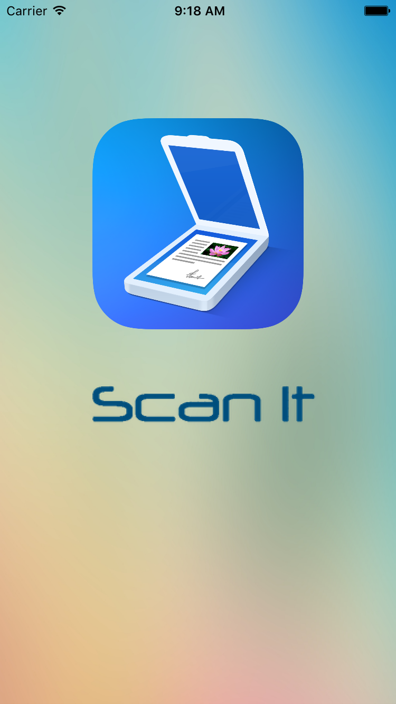

# ScanIt
Scan It is an Ios Application, implementing Tessaract Library for Optical Character recognition. Take a picture or choose a picture from your library and scan it, to get the text out of image for your use.

